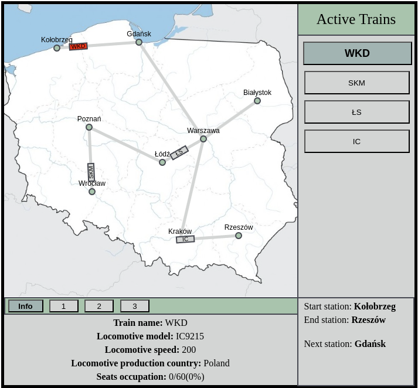
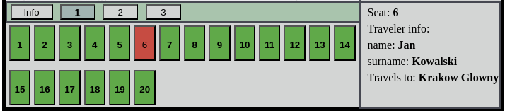
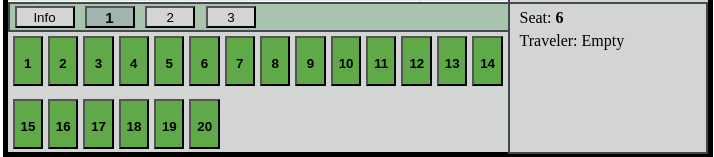
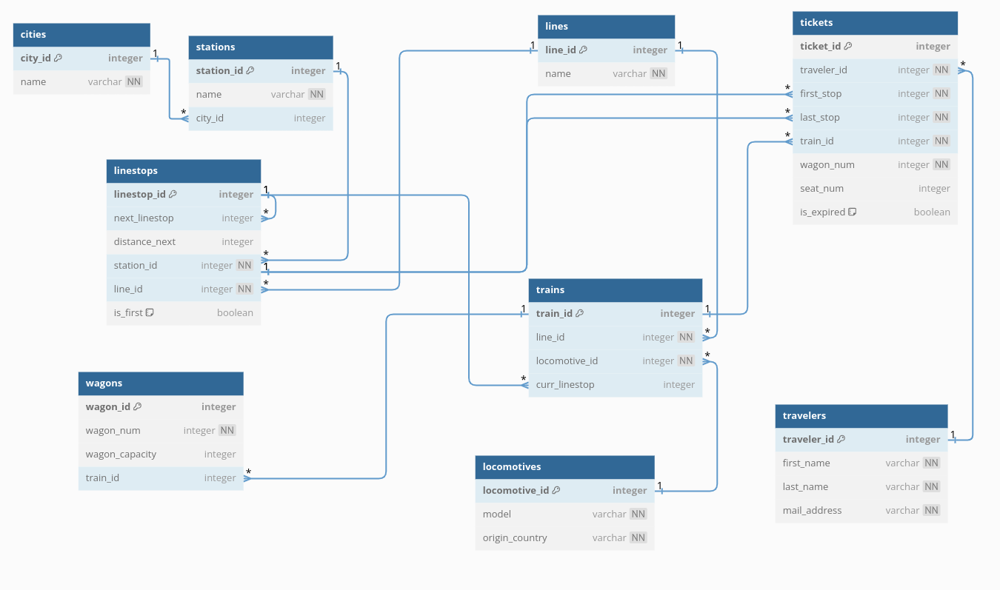
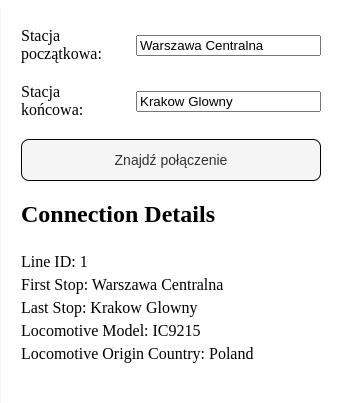
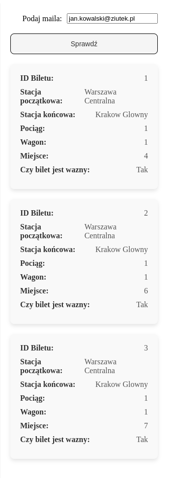
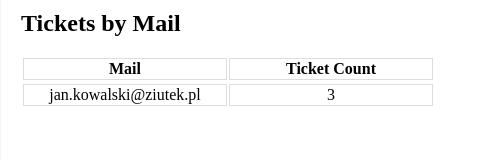

# TrainManager
## A group programming project created for a college assignment.
The project involves creating an application that simulates railway traffic, including the ability to search for connections and purchase tickets. The application is divided into three layers: Application (Frontend), Backend, and Database.
## My part of the project
In the group, I was responsible for developing the visual simulation that connects to an H2 database using SpringBoot endpoints. Most of my code can be found [here](front_merge/src/Canvas).
## Simulation
The simulation view, which I developed as my first React app, worked out very well. The interface is straightforward, visually appealing, and informative. It offers a smooth user experience, effectively presenting the simulated data.

## Database logic model
The database logic model, which was later implemented using an H2 database and an [SQL file](src/main/resources/schema.sql).

## Tickets management
Ticket forms are used for easy ticket purchasing simulation and allow access to database objects for later analysis. Tickets appear in the simulation view in real-time and are managed by it afterward.
  
  

## Technologies
Technologies used in this project are:
* Fronted - React JS, Vite
* Backend - Java Spring Boot
* Database - H2 Database

